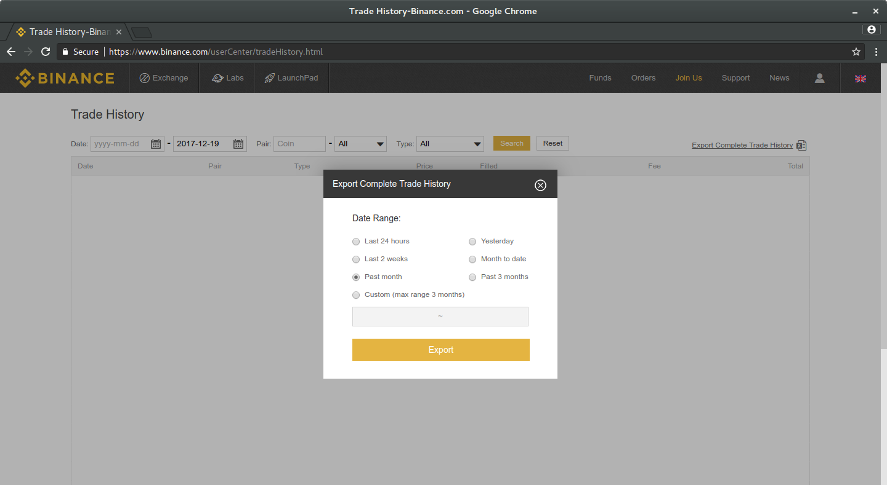
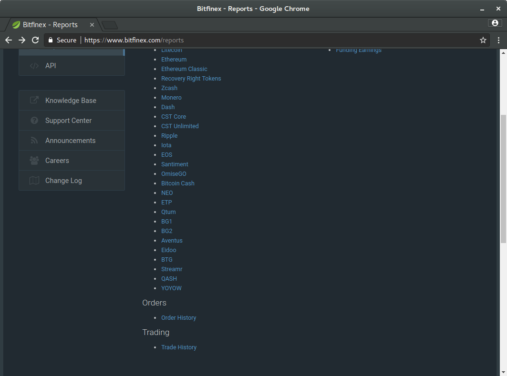
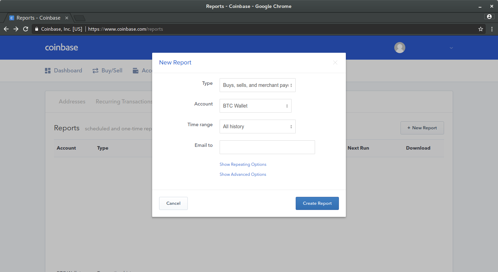
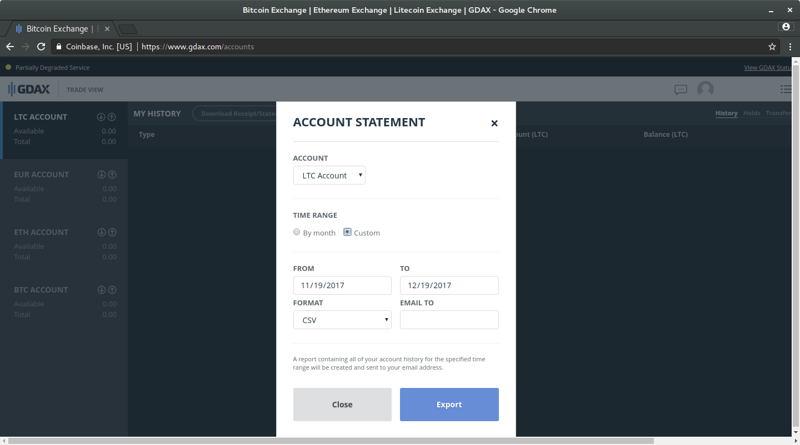

# How to import your transactions

## Supported exchanges

- [Binance](#binance)
- [Bitfinex](#bitfinex)
- [Coinbase](#coinbase)
- [GDAX](#gdax)

## Binance

0. Go to the [trade page](https://www.binance.com/userCenter/tradeHistory.html).
0. Click the `Export Complete Trade History` link on the right
0. Select the dates and click `Export`
0. Do the same for [your deposit history](https://www.binance.com/user/getMoneyLog.html?action=download&direction=0) and [your withdrawal history](https://www.binance.com/user/getMoneyLog.html?action=download&direction=1)


## Bitfinex

0. Go to the [report page](https://www.bitfinex.com/reports).
0. Scroll down and click the `Trade History` link
0. Select the dates and download the file
0. Do the same for your `Deposits` and `Withdrawals` movements


## Coinbase

0. Go to the [report page](https://www.coinbase.com/reports).
0. Click the `New Report` button
0. Select `Transaction history`
0. Select the dates and the account (`BTC`, `LTC` ...)
0. Click `Create Report`
0. Soon you'll receive an e-mail from Coinbase with a link to download the report

0. However Coinbase does not mark the name of the coin, so you have to mark it yourself.
0. Open the `.csv` file; it should be like
    ```
    Transfers
    User,email@gmail.com,5fdhw3728bdk129bfaae09f
    
    Timestamp,Type,BTC,Subtotal,Fees,Total,Currency,Price Per Coin,Payment Method,ID,Share
    2017-05-14 09:06:58 -0700,Buy,0.00382377,9.0,0.99,9.99,EUR,2353.7,MasterCard ********6728,fnwiibfi829bve9102bf9f,0
    2017-07-14 09:07:30 -0700,Buy,0.00381793,9.0,0.99,9.99,EUR,2357.3,MasterCard ********6728,5941fnwiibfi829bvebe96,0
    2017-09-24 02:48:24 -0700,Buy,0.04605967,144.24,5.76,150.0,EUR,3131.59,MasterCard ********6995,59c7fnwiibfi829bvea361,0
    ```
0. Change (line 3) `BTC` to the exact name of the coin you just exported. e.g if you exported you `LTC` account transactions, change `BTC` to `LTC`


## GDAX

0. Go to [your accounts page](https://www.gdax.com/accounts).
0. Click the `Download Receipt/Statement` button
0. Select the dates and the `CSV` format (not `PDF`)
0. Soon you'll receive an e-mail from Coinbase with a link to download the report

