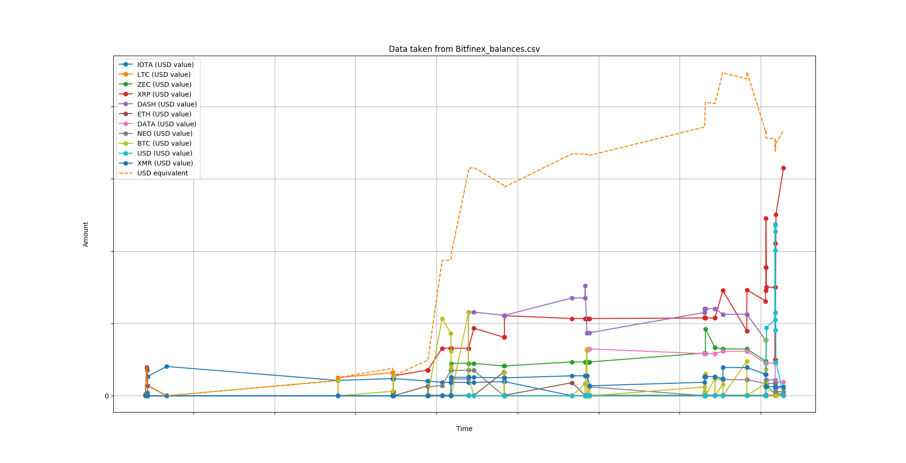

# Pyhodl

[](https://opensource.org/licenses/Apache-2.0) [](https://github.com/MY_USERNAME/MY_REPOSITORY/issues) [](https://www.apache.org/licenses/LICENSE-2.0)

> Framework to download, update, analyze and plot your crypto-transactions

## Table of content

- [Key Features](#key-features)
- [Overview](#overview)
- [Settings](#settings)
- [Usage](#usage)
- [Install](#install)
- [Changelog](#changelog)
- [Contribute](#contribute)
- [License](#license)
- [Links](#links)
- [You may also like...](#you-may-also-like)

## Key Features

* continuous (hourly) updates from your exchanges
* completely off-line
* you own your data
* analyze profit and ROI of transactions
* plot charts of your capital
* stats and trends
* cross-OS
* supported exchanges:
    - Binance
    - Bitfinex
    - Coinbase
    - GDAX
    
## Settings
`pyhodl` needs general settings to run. For more information please refer to [the guide](WRITE_CONFIGS.md).


## Overview
`pyhodl` consists of 4 submodules:
- `updater`: syncs local data with the transactions from your exchanges. Can run as daemon and can update every other minute.
- `plotter`: creates charts with local data. Saves `.png` images too.
- `stats`: Computes statistics and trends using local data. Correlations, future prices, trading analysis and so on-
- `controller`: Manages your data, parses raw downloads and fix API errors. You cannot invoke this module directly.

## Usage

```bash
$ pyhodl [options]
```

To import your transactions, please refer to [the guide](IMPORT_DATA.md).

### Supported commands

The following flags are supported:

| Flag | Description |
| --- | --- |
| `-updater` | Activates `updater` mode |
| `-plotter` | Creates charts of your data |
| `-stats` | Builds and computes stats and trends |

### Example
A simple run with parameters like
```bash
pyhodl.py -plotter
```
would result in a series of plot like this one:


Note that actual data has been omitted

## Install
Just run `./install.sh` and test your installation with `pyhodl -h`. Should come out
```bash
usage: -[mode] -h/--help for full usage

optional arguments:
  -h, --help           show this help message and exit
  -updater, --update   Syncs local data with the transactions from your
                       exchanges
  -plotter, --plot     Creates charts of your data
  -stats, --stats      Computes statistics and trends using local data
  -verbose, --verbose  Increase verbosity
```

## Changelog
See [CHANGELOG](https://github.com/sirfoga/pyhodl/blob/master/CHANGELOG.md)

## Contribute

[](https://github.com/sirfoga/pyhodl/issues) [](https://opensource.org/licenses/Apache-2.0)

0. [Open an issue](https://github.com/sirfoga/pyhodl/issues/new)
0. [fork](https://github.com/sirfoga/pyhodl/fork) this repository
0. create your feature branch (`git checkout -b my-new-feature`)
0. commit your changes (`git commit -am 'Added my new feature'`)
0. publish the branch (`git push origin my-new-feature`)
0. [open a PR](https://github.com/sirfoga/pyhodl/compare)

## License

[](https://app.fossa.io/projects/git%2Bhttps%3A%2F%2Fgithub.com%2Fsirfoga%2Fpyhodl?ref=badge_shield) [](https://opensource.org/licenses/Apache-2.0)

[Apache License](http://www.apache.org/licenses/LICENSE-2.0) Version 2.0, January 2004

## Links

* [Documentation](https://sirfoga.github.io/pyhodl)
* [Issue tracker](https://github.com/sirfoga/pyhodl/issues)
* [Source code](https://github.com/sirfoga/pyhodl)

## You may also like...

- [cryptowatch](https://sirfoga.github.io/cryptowatch/) - Uses cryptowat.ch and tradingview.com APIs to display charts side-by-side
