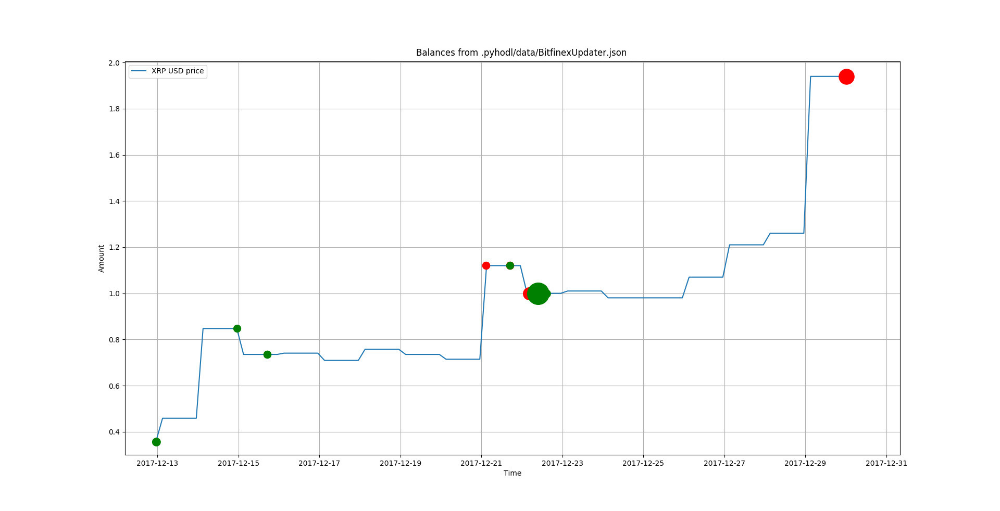
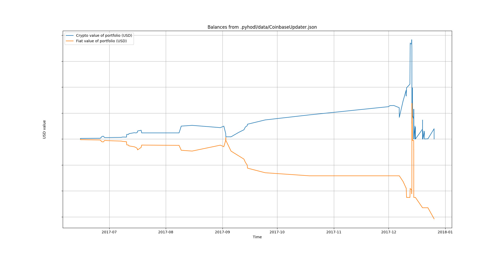

# Pyhodl

> Download, update, analyze and plot your crypto-transactions. Completely off-line and secure (you own your data). Made with love and crypto money.

[](https://landscape.io/github/sirfoga/pyhodl/master) [](https://bettercodehub.com/) [](https://codeclimate.com/github/sirfoga/pyhodl) 

 

## Table of content

- [Key Features](#key-features)
- [Usage](#usage)
- [Install](#install)
- [Changelog](#changelog)
- [Contribute](#contribute)
- [License](#license)
- [Links](#links)
- [You may also like...](#you-may-also-like)

## Key Features

* continuous (hourly, daily, you-decide-when) updates from your exchanges
* completely off-line
* **you** own your data
* analyze profit and ROI of transactions
* plot charts (buy/sells, prices, market cap ...)
* stats and trends
* cross-OS
* supported exchanges:
    - Binance
    - Bitfinex
    - Coinbase
    - GDAX
    
## Usage

```bash
$ pyhodl [options]
```
To specify your settins, please refer to [this](WRITE_CONFIGS.md).
To import your transactions, please refer to [the guide](IMPORT_DATA.md).

### Supported commands

The following flags are supported:

| Flag | Description |
| --- | --- |
| `-hist HIST` | Downloads historical prices of your coins |
| `-plot PLOT` | Creates charts of your data |
| `-stats STATS` | Computes statistics and trends using local data |
| `-verbose, --verbose` | Increase verbosity |
| `-tor` | Connect to tor via this password (advanced) |

### Example
A simple run with parameters like
```bash
pyhodl -plot "~/.pyhodl/data/BitfinexUpdater.json" -verbose
```
would result in a series of plot like this one:


while if you want to plot your gains against your total spent, just run
```bash
-plot -verbose
```




## Install
Just run `./install.sh` and test your installation with `pyhodl -h`. Should come out
```bash
usage: -[mode] -h/--help for full usage

optional arguments:
  -h, --help           show this help message and exit
  -update, --update    Syncs local data with the transactions from your
                       exchanges
  -hist HIST           Downloads historical prices of your coins
  -plot PLOT           Creates charts of your data
  -stats STATS         Computes statistics and trends using local data
  -verbose, --verbose  Increase verbosity
  -tor TOR             Connect to tor via this password (advanced)
```
To run the tests (please do):
```bash
python3 setup.py test
```

## Changelog
See [CHANGELOG](https://github.com/sirfoga/pyhodl/blob/master/CHANGELOG.md)

## Contribute

[](https://github.com/sirfoga/pyhodl/issues) [](https://opensource.org/licenses/Apache-2.0)

0. [Open an issue](https://github.com/sirfoga/pyhodl/issues/new)
0. [fork](https://github.com/sirfoga/pyhodl/fork) this repository
0. create your feature branch (`git checkout -b my-new-feature`)
0. commit your changes (`git commit -am 'Added my new feature'`)
0. publish the branch (`git push origin my-new-feature`)
0. [open a PR](https://github.com/sirfoga/pyhodl/compare)

## License

[](https://app.fossa.io/projects/git%2Bhttps%3A%2F%2Fgithub.com%2Fsirfoga%2Fpyhodl?ref=badge_shield) [](https://opensource.org/licenses/Apache-2.0)

[Apache License](http://www.apache.org/licenses/LICENSE-2.0) Version 2.0, January 2004

## Links

* [Documentation](https://sirfoga.github.io/pyhodl) (last docs script run unsuccessfully (`"/usr/local/lib/python2.7/dist-packages/epydoc/docwriter/dotgraph.py", line 470, in __init__
    for var in class_doc.sorted_variables:
TypeError: iteration over non-sequence
`). You can find the lastest docs [here](https://github.com/sirfoga/pyhodl/commit/8471b6cffdce7c2b2ac78928c550fa6cb9bf74c8))
* [Issue tracker](https://github.com/sirfoga/pyhodl/issues)
* [Source code](https://github.com/sirfoga/pyhodl)

## You may also like...

- [cryptowatch](https://sirfoga.github.io/cryptowatch/) - Uses cryptowat.ch and tradingview.com APIs to display charts side-by-side
