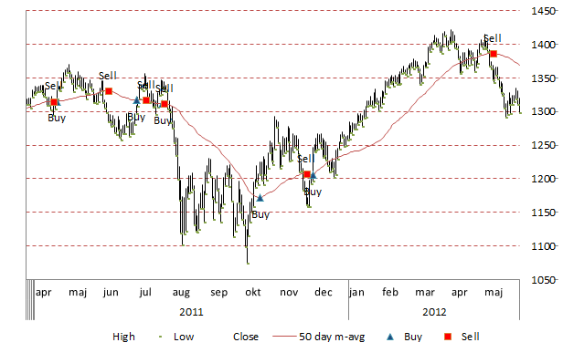
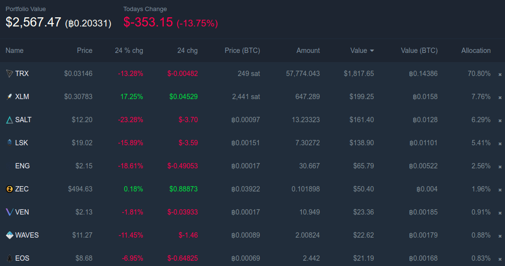

# TODOs
All improvements and features planned for the future

## Table of content

- [Buy/sell chart](#buysell-chart)
- [More charts](#more-charts)
- [Crypto market cap](#crypto-market-cap)
- [More parsers](#more-parsers)
- [Current portfolio value](#current-portfolio-value)
- [Trade analysis](#trade-analysis)
- [Web platform](#web-platform)

## Buy/sell chart
Like [cointracking.info](cointracking.info)

## More charts
- [x] subtotal balances by transaction date
- USD equivalent (or any other fiat currency) by transaction date
- crypto VS fiat balance
- account value (earned - spent) VS crypto market cap

## Crypto market cap
- download data

## More parsers
- parse historical data + nice models/object
- merge single exchange data into one big database

## Current portfolio value
Like [coin.fyi](coin.fyi)

## Trade analysis
Very useful, needed economist or day-trader suggestions

## Web platform
Local web server to display real-time data and charts
